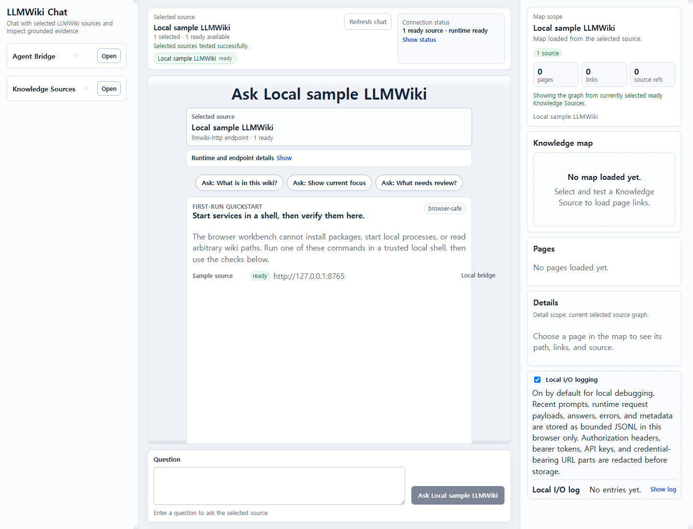
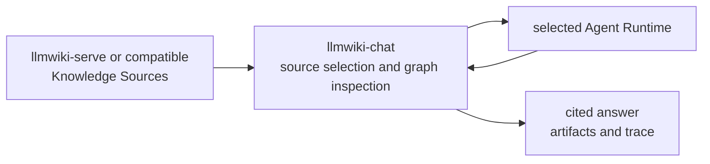

# LLM Wiki Chat

`llmwiki-chat` is the browser workbench for the LLMWiki toolchain. It connects
read-only Knowledge Sources such as `llmwiki-serve` to an external Agent
Runtime, then lets a human inspect source readiness, pages, graph context,
citations, artifacts, and trace steps.

Use it when:

- You want to verify sources and graph context before asking an agent runtime.
- You need a UI for choosing sources and runtime adapters while reviewing cited
  outputs.
- You are running the local loop with `llmwiki-serve` plus either Local
  Development Runtime, `llmwiki-agent-bridge`, or another A2A-style runtime.

In the toolchain, `llmwiki-serve` serves evidence, `llmwiki-agent-bridge` can
synthesize answers through an OpenAI-compatible runtime, and `llmwiki-chat`
provides the browser inspection and review surface.

[](https://github.com/knowledge-bridge-labs/llmwiki-chat/actions/workflows/ci.yml)
[](./LICENSE)
[](https://nodejs.org/)

[Quick Start](#quick-start) | [How It Works](#how-it-works) | [Runtime adapters](docs/agent-runtime-adapters.md) | [Release checklist](docs/release.md) | [Docs portal](https://knowledge-bridge-labs.github.io/llmwiki-docs/) | [Quickstart docs](https://knowledge-bridge-labs.github.io/llmwiki-docs/quickstart) | [Release status](https://knowledge-bridge-labs.github.io/llmwiki-docs/status) | [Contributing](CONTRIBUTING.md) | [Security](SECURITY.md) | [Support](SUPPORT.md) | [Changelog](CHANGELOG.md)

> Public-preview note: npm install is available for `llmwiki-chat@0.1.0`.
> Source checkout remains supported for local development and release checks.

It is not a model server, hosted RAG app, wiki compiler, ingestion pipeline,
vector database, crawler, credential store, or production runtime host.

It is independent community tooling for LLM Wiki-style Markdown knowledge
folders and agent-readable context. It is not an official project from Andrej
Karpathy or any upstream producer named in compatibility examples.

Use the workbench to:

- Add and readiness-test LLMWiki-compatible source endpoints.
- Inspect pages, graph context, source refs, citations, artifacts, and trace
  steps.
- Exercise the UI with `Local Development Runtime`, or connect an externally
  managed A2A-style runtime with `Custom A2A`.
- Keep source selection and answer inspection visible while the selected runtime
  owns planning, model calls, and answer quality.

The repository does not bundle, launch, host, or manage a production Agent
Runtime. Hermes and DeepAgents are A2A-style named runtime slots. Copilot is
modeled only as an external Agent Runtime candidate for agents that consume
MCP-style JSON-RPC or A2A-style message tool surfaces. These named slots are not
product-validated integrations or dedicated adapters in this repository yet.
For local Hermes, DeepAgents, or generic OpenAI-compatible bridge workflows,
run the separate `llmwiki-agent-bridge` companion service from a sibling
checkout or npm package.

## Quick Start

Prerequisites: Git, Node.js 22.12 or newer with npm 10 or newer, and `uv`. The
sample Knowledge Source uses `llmwiki-serve`, which requires Python 3.11 or
newer; `uv` can install and manage that Python version if needed.

Start a sample Knowledge Source in one shell:

```bash
git clone https://github.com/knowledge-bridge-labs/llmwiki-serve.git
cd llmwiki-serve
uv sync --extra dev
uv run llmwiki-serve serve ./examples/sample-wiki --host 127.0.0.1 --port 8765
```

Start the browser workbench in another shell:

```bash
git clone https://github.com/knowledge-bridge-labs/llmwiki-chat.git
cd llmwiki-chat
npm ci
npm run dev
```

Open the Vite URL printed by `npm run dev`, then follow the first-run flow:

1. Start with the Quickstart panel in the empty chat state. The panel shows
   copyable shell commands for `llmwiki-serve` and `llmwiki-agent-bridge` and
   makes the browser/process boundary explicit.
2. Use the prefilled `Local sample LLMWiki` source first. Confirm its URL is
   `http://127.0.0.1:8765`, then click `Test sample source` or `Test source`.
3. A ready source loads page, graph, and citation context into the Knowledge
   map, Pages, and Details panels.
4. To connect another source, open `Add source`, choose `LLMWiki HTTP` or
   `MCP`, enter the endpoint URL, and click `Add`.
5. Prefer the default Local Agent Bridge A2A or MCP path when
   `llmwiki-agent-bridge` is running at `http://127.0.0.1:8788`; confirm the
   bridge URL and click `Test bridge`.
6. When the bridge is ready, chat discovers the bridge's registered Knowledge
   Sources and shows them as bridge-managed, read-only source cards. Edit those
   sources in the bridge settings page. Keep direct source cards in chat for
   standalone `llmwiki-serve` testing and debugging.
7. If no bridge is running, switch to `Local Development Runtime` under
   testing/developer runtime options for deterministic UI, trace, citation, and
   graph rendering checks. It is not an answer-quality runtime.
8. Or add `Custom A2A`, enter an external A2A runtime URL, optionally enter a
   bearer token for that runtime, click `Test runtime`, and then ask.
9. Review the answer, citations, artifacts, and trace before treating the result
   as useful.

The Vite command starts only the browser client. It does not start
`llmwiki-serve`, host a production runtime, or make model-provider calls by
itself. The default Knowledge Source URL is `http://127.0.0.1:8765`, matching
the sample server above. If the browser opens the chat client through a
non-local hostname, the default source URL follows that browser host on port
`8765`; start `llmwiki-serve` on a reachable interface or edit the source URL
before testing.

Use `llmwiki-http` for a `llmwiki-serve` base URL such as
`http://127.0.0.1:8765`, and `mcp` for a compatible JSON-RPC endpoint whose
tool path resolves to `/mcp`. A2A-style Knowledge Source endpoints are an
advanced, non-default source-adapter path until the Add source picker exposes
them directly. Browser fetches must be allowed by the source's CORS policy.

When accessing the client from another device on the same trusted network,
prefer a tunnel or bind Vite to a specific trusted LAN interface:

```bash
npm run dev -- --host <trusted-lan-ip>
```

Use this only on a trusted LAN. Do not expose the development server together
with private Knowledge Sources, runtime bearer tokens, or bridge endpoints unless
the surrounding network is protected.

## Security Snapshot

| Boundary | Default behavior |
| --- | --- |
| Agent Runtime URLs | `Custom A2A` and named external runtime URLs must use public HTTPS, or loopback HTTP(S) for local development. Private or tailnet runtime URLs require `VITE_LLMWIKI_CHAT_ALLOW_PRIVATE_AGENT_RUNTIME_URLS=true` in local dev. |
| Knowledge Source URLs | Public HTTPS is the best default for shared deployments. HTTP, private, tailnet, local, single-label, `.local`, `.internal`, and other non-public source URLs are allowed for OSS, local, and private use; the UI warns when selected sources may be unreachable or unsafe for external runtimes. |
| Bearer tokens | Runtime bearer tokens stay in current-tab browser state, are sent only as `Authorization: Bearer ...` for agent-card discovery and `message:send`, and are not saved to localStorage, Knowledge Source descriptors, runtime request bodies, or package artifacts. |
| Provider secrets | Keep model-provider keys in the external runtime or `llmwiki-agent-bridge` process environment. Do not paste provider keys into the browser. |
| Local I/O logging | The browser workbench keeps a bounded, default-on local JSONL log in localStorage for debugging prompts, runtime request payloads, answers/errors, and response metadata. Use the `Local I/O logging` toggle to opt out and clear raw entries; Authorization headers, bearer tokens, API-key shaped values, and credential-bearing URL parts are redacted before storage. |

## Release Status

`llmwiki-chat` is in public preview and published as `llmwiki-chat@0.1.0`.
Source checkout remains supported for local development and release checks.
See the [release checklist](docs/release.md) and hosted release status for the
current posture.

## Demo



The screenshot shows the current browser-safe first-run Quickstart panel with
sanitized loopback sample values. It does not show a connected production
runtime, private Knowledge Source, or managed backend automation.

## Workbench Modes

| Mode | Use when | What to verify |
| --- | --- | --- |
| Source inspection | You want to inspect one or more Knowledge Sources before asking. | Source status is `ready`, Pages and Details show expected graph context, and citations point to source refs. |
| Local Development Runtime | You need deterministic UI, trace, citation, and graph rendering checks. | The local runtime is selected, answer traces render, and no production model quality claim is made. |
| Custom A2A runtime | You have an externally managed runtime that exposes an A2A-style agent card and `message:send`. | Runtime URL policy passes, `Test runtime` marks it ready, and selected sources are reachable by the runtime or proxy path. |
| Named runtime slot | You are validating a Hermes or DeepAgents-compatible runtime identity. | The agent card identity matches the selected slot; otherwise use Custom A2A. |

Answer review keeps run details with the assistant answer so the execution path
does not jump after completion. When a runtime returns structured citation ids
on trace steps, the visible evidence buttons follow that read order while
inline markdown citation links still resolve to the runtime's original citation
targets.

## LLMWiki Toolchain

| Repo/package | Role | Use when | Validation command |
| --- | --- | --- | --- |
| `llmwiki-serve` | Read-only Knowledge Source server. | You have an existing Markdown or LLMWiki-style folder to expose to agents. | `uv run python scripts/release_smoke.py` |
| `llmwiki-agent-bridge` | Runtime companion bridge. | Hermes, DeepAgents, or a generic OpenAI-compatible local runtime needs one endpoint that gathers source evidence and returns cited answers. | `npm run check` |
| `llmwiki-chat` | Browser workbench. | You want to connect sources, inspect graph context, choose a runtime, and review traces. | `npm run check` |
| `llmwiki-docs` | Cross-repo documentation portal. | You need the quickstart, protocol map, deployment posture, and release checklist in one place. | `npm run check` |

Use `llmwiki-agent-bridge` when an OpenAI-compatible local runtime should sit
behind an A2A-style endpoint for `llmwiki-chat`. The public-preview bridge
package is `llmwiki-agent-bridge@0.1.0`:

```bash
LLMWIKI_AGENT_BRIDGE_BASE_URL=http://127.0.0.1:8642/v1 \
LLMWIKI_AGENT_BRIDGE_MODEL=local-model \
LLMWIKI_AGENT_BRIDGE_RUNTIME_PROFILE=generic \
npm exec --package llmwiki-agent-bridge@0.1.0 -- llmwiki-agent-bridge
```

For bridge development or release checks, a sibling source checkout remains
supported; from that checkout, run `npm ci` and `npm exec -- llmwiki-agent-bridge`
with the same environment variables. Use `LLMWIKI_AGENT_BRIDGE_SOURCE_POLICY`
and `LLMWIKI_AGENT_BRIDGE_ALLOWED_SOURCE_ORIGINS` to control which Knowledge
Source origins the bridge may fetch. If the bridge requires callers to
authenticate, set `LLMWIKI_AGENT_BRIDGE_BEARER_TOKEN` in the bridge process and
enter that runtime bearer token in the `llmwiki-chat` runtime setup panel.

## What It Does

| Need | Use `llmwiki-chat` for | Use something else for |
| --- | --- | --- |
| Source setup | Add and test direct HTTP and MCP-style JSON-RPC Knowledge Source endpoints, or inspect bridge-managed source cards discovered from a ready Agent Bridge. Treat A2A-style source endpoints as advanced/non-default until the picker supports them. | Compiling, crawling, embedding, hosting wiki content, or editing bridge-owned source registration. |
| Source inspection | Browse pages, graph context, source refs, and citation targets before asking. | Long-term knowledge management or source authoring. |
| Runtime selection | Choose `Local Development Runtime`, `Custom A2A`, or a named A2A runtime slot. | Running the model stack, planner, tools, or production runtime service. |
| Answer review | Inspect citations, artifacts, and trace steps behind a runtime response. | Judging production answer quality without a real external runtime. |

## Repository Structure

| Path | Purpose |
| --- | --- |
| `src/` | React app, source clients, runtime adapters, graph helpers, styles, and unit tests. |
| `docs/` | Runtime adapter notes, release checklist, and public image assets. |
| `e2e/` | Playwright flows and live-runtime/source smoke helpers. |
| `scripts/` | License artifact generation and dist cleanup helpers. |
| `package.json`, `package-lock.json` | Node package metadata and locked development environment. |
| `vite.config.ts`, `tsconfig*.json`, `eslint.config.js` | Frontend build, typecheck, and lint configuration. |

## How It Works



In all supported modes, the selected runtime and model stack own planning,
tool-use strategy, and production answer quality. The client owns source
selection, adapter configuration, trace rendering, citations, and graph context
display.

## Package Artifact

`llmwiki-chat@0.1.0` is published on npm. The npm package is a static
distribution artifact for downstream static hosting and documentation review.
It contains the built browser app under `dist/`, public docs, package metadata,
retained third-party license texts, and community governance files. It does not
include a bridge binary, embedded bridge implementation, hosted service, model
runtime, or production web server.

Source checkout usage remains supported for local development and release
checks. Consumers can unpack the package and host the static `dist/` directory
with their preferred web server. Runtime bridge workflows use the separate
`llmwiki-agent-bridge@0.1.0` package with
`npm exec --package llmwiki-agent-bridge@0.1.0 -- llmwiki-agent-bridge`, or a
bridge source checkout for bridge development and release checks.

## Supported Usage Modes

1. `llmwiki-serve` end-to-end: run a local or hosted `llmwiki-serve` process,
   connect `llmwiki-chat` to its HTTP or MCP-style JSON-RPC endpoint, and
   validate the LLMWiki knowledge-source flow. A2A-style source adapters remain
   advanced/non-default until the Add source picker supports them.
2. External Agent Runtime console: connect an externally managed Agent Runtime
   through an Agent Runtime adapter. If that runtime is
   `llmwiki-agent-bridge`, chat discovers the bridge's registered Knowledge
   Sources after the bridge is ready and shows them as bridge-managed,
   read-only source cards. Direct source cards remain available for standalone
   `llmwiki-serve` testing.

Do not treat the mock adapter as the production answer-quality standard. Real
answer quality belongs to the external runtime and model stack connected through
`Custom A2A` or a future validated product-specific adapter.

## Runtime Expectations

Knowledge Source endpoints are read-only. `llmwiki-serve` exposes the protocol
shapes the client expects. The current Add source picker exposes HTTP and
MCP-style JSON-RPC sources; A2A-style Knowledge Sources are advanced/non-default
until picker support is added:

- HTTP: `GET /manifest`, `GET /graph?limit=500`, and `POST /query`.
- MCP-style JSON-RPC: `tools/list` plus `tools/call` for `llmwiki_context` and
  `llmwiki_graph`, normally at `/mcp`.
- A2A-style message: an agent card at `/.well-known/agent-card.json`, a
  `message:send` endpoint, and a `llmwiki_context` artifact data part.

Agent Runtime adapters are separate from Knowledge Source protocol adapters.
`Custom A2A` discovers an agent card and posts the user query, run context,
selected source descriptors, and callable tool descriptions. It intentionally
sends descriptors rather than the raw knowledge graph by default.

Bearer tokens entered for protected A2A runtimes are runtime-local secret
material. The UI keeps them in current-tab browser state, sends them only as
`Authorization: Bearer ...` for agent-card discovery and `message:send`, and
does not save them to localStorage, Knowledge Source descriptors, runtime request
bodies, or package artifacts.

For detailed adapter contracts, structured result expectations, named-slot
identity checks, validation guidance, and companion bridge setup, see
[docs/agent-runtime-adapters.md](docs/agent-runtime-adapters.md).

## Network And Security Boundaries

- External Agent Runtime URLs must use public HTTPS, or loopback HTTP(S) for
  local development. For private tailnet or lab testing, start the dev server
  with `VITE_LLMWIKI_CHAT_ALLOW_PRIVATE_AGENT_RUNTIME_URLS=true`; keep this
  override off for public or hosted deployments. This override applies to
  external Agent Runtime URLs, not to advanced A2A Knowledge Source agent-card
  `message:send` URLs discovered by the client.
- Public HTTPS Knowledge Source URLs are the best default for shared
  deployments. HTTP, private, tailnet, local, single-label, `.local`,
  `.internal`, and other non-public source URLs are allowed for OSS, local, and
  private use and will show an advisory warning with external runtimes.
- Browser-side public-HTTPS guidance is an advisory and accidental-disclosure
  guard, not a complete network security boundary. Strict or public deployments
  should enforce proxy or runtime allowlists, DNS/IP checks after resolution,
  redirect policy, authentication, rate limits, and egress controls for any
  Knowledge Source URL they receive.
- Keep runtime provider keys in the external runtime or `llmwiki-agent-bridge`
  process environment. Do not paste model-provider keys into the browser.
- Local I/O logging is enabled by default to make static-app debugging
  accessible without server file writes. It stores recent sanitized JSONL
  entries in this browser's localStorage only; opt out with the
  `Local I/O logging` toggle or use the panel's clear control before demos,
  screenshots, or shared-device use.
- Do not add real credentials, bearer tokens, private endpoint URLs, private
  exports, raw sensitive request logs, or screenshots with private
  infrastructure to examples, issues, docs, tests, or release artifacts.

Report suspected vulnerabilities privately through the process in
[SECURITY.md](SECURITY.md).

## Local Development And Validation

For normal UI work, run the focused checks that match your change. The baseline
public validation gates and package release checklist live in
[docs/release.md](docs/release.md). Before opening a pull request, read
[CONTRIBUTING.md](CONTRIBUTING.md) and include the affected usage mode, runtime
adapter, Knowledge Source endpoint protocol, and validation results.

To run the live Playwright path against a real sample `llmwiki-serve` source,
place a `llmwiki-serve` checkout next to this repo and run:

```bash
npm run test:e2e:live
```

The script syncs that checkout with `uv`, starts two `examples/sample-wiki`
servers on free loopback ports, waits for `/health`, and passes them to the live
spec as `LLMWIKI_LIVE_SERVE_URL` and `LLMWIKI_LIVE_SERVE_URL_2`. That default
runs the multi-source provenance coverage. If the serve checkout is elsewhere,
set `LLMWIKI_SERVE_ROOT=/path/to/llmwiki-serve`. To keep only the original
single local source smoke, set `LLMWIKI_LIVE_SERVE_SINGLE_SOURCE=1`.

To use one or more already running endpoints instead, keep the explicit URL
flow. When `LLMWIKI_LIVE_SERVE_URL` or `LLMWIKI_LIVE_SERVE_URLS` is set, the
script does not start local servers; include `LLMWIKI_LIVE_SERVE_URL_2` or
`LLMWIKI_LIVE_SERVE_URLS=url1,url2` for external multi-source coverage:

```bash
LLMWIKI_LIVE_SERVE_URL=http://127.0.0.1:8765 npm run test:e2e:live
```

Repository URLs point to the Knowledge Bridge Labs organization:
`https://github.com/knowledge-bridge-labs/llmwiki-chat`.

## Community

Before opening a pull request, read [CONTRIBUTING.md](CONTRIBUTING.md), keep
changes focused on one usage mode, and include validation results for the
affected source protocol, runtime adapter, or UI flow.

Use GitHub issues for reproducible bugs, focused feature requests, runtime or
protocol compatibility notes, accessibility findings, and documentation gaps.
Keep examples public and sanitized; do not include credentials, bearer tokens,
private endpoint URLs, raw sensitive wiki content, or private runtime logs.

- [Support guide](SUPPORT.md)
- [Security policy](SECURITY.md)
- [Code of conduct](CODE_OF_CONDUCT.md)

For vulnerabilities, follow [SECURITY.md](SECURITY.md) instead of opening a
detailed public issue.

## License

Apache-2.0. See [LICENSE](LICENSE), [THIRD_PARTY_NOTICES.md](THIRD_PARTY_NOTICES.md),
and the generated [THIRD_PARTY_LICENSES.md](THIRD_PARTY_LICENSES.md) retained
for redistributed production dependencies.
